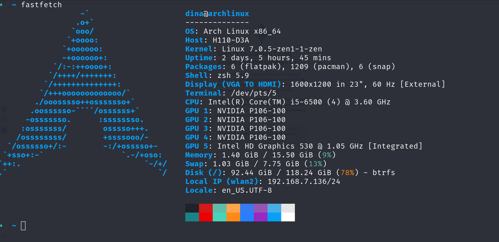
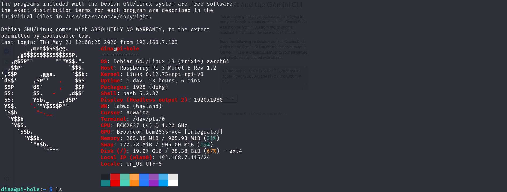
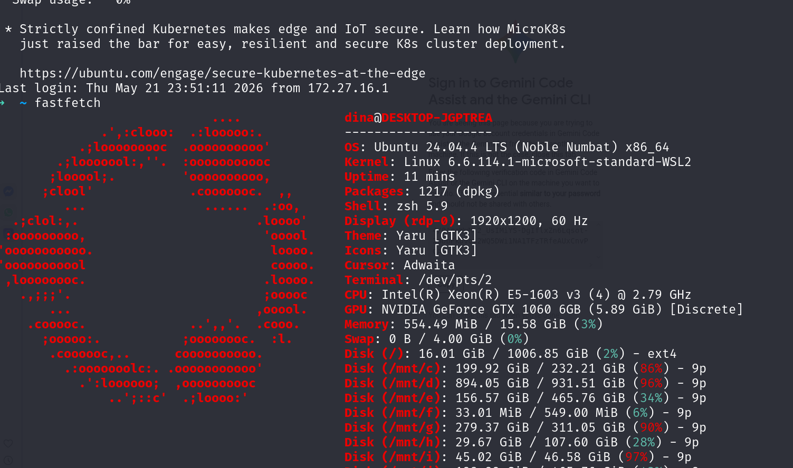

# Lab Infrastructure Gallery

This gallery showcases the operational status and visual configuration of the sovereign laboratory environment.

## 🖥️ Workstation Visualization

### 1. Dell Precision Orchestrator Dashboard

*View of the Open WebUI and Monitoring interface on the orchestrator node.*

### 2. Arch Linux GPU Cluster

*GPU utilization metrics during active LLM inference.*

### 3. Network & Security Analysis

*Visual representation of the automated security reconnaissance tools.*

---
*Note: All images have been sanitized to remove sensitive network information and user details.*
EOF
,file_path: